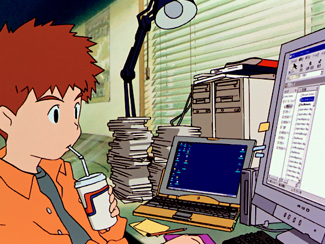

# Hey there! :wave:

I'm Marcelo, but call me Celo, a ___rōnin___ software developer based in Brazil.

## About me

- 💼 I'm currently not working, so I'm available for new opportunities.
- 🎓 Graduated from Positivo University with a b. tech in Analysis and systems development.
- 🌱 Always eager to learn and explore new technologies.
- 💚 Back-end and mobile development attract my heart.

## My Stats

## My Top Langs

## Blog posts
<!-- BLOG-POST-LIST:START -->
- [Da Dúvida à Decisão - Escolhendo a Linguagem de Programação Certa para Você](https://uminocelo.hashnode.dev/como-escolher-linguagem-programacao)
- [Navegando nas Ondas da Dúvida: Me preparando para uma Nova Jornada de Superação](https://uminocelo.hashnode.dev/superando-a-sindrome-do-impostor-como-desenvolvedor-de-software)
- [O nosso amiguinho HTTP](https://dev.to/uminocelo/o-nosso-amiguinho-http-42b9)
<!-- BLOG-POST-LIST:END -->

## Studies

## Interests

- 📺 Watching: One Piece and Jujutsu Kaisen.
- 🎧 Music: enjoying the beat of the moment, techno, edm and hip-hop/rap.
- 🎮 Games: Marvel's Spider-Man(PS4) and The Legend of Zelda: Breath of the Wild(switch).

___

Feel free to reach out if you'd like to collaborate or chat about anything tech-related! 😄

⚔️👺 ___You can find some projects with funny or geek/otaku names, I'm sorry___ 👺⚔️